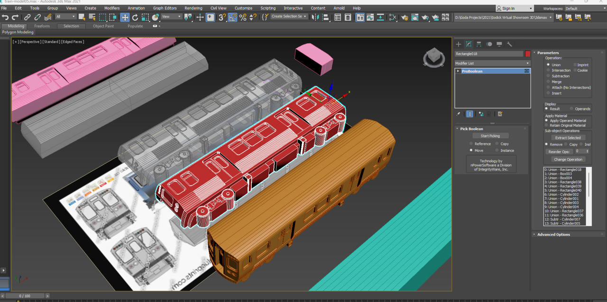
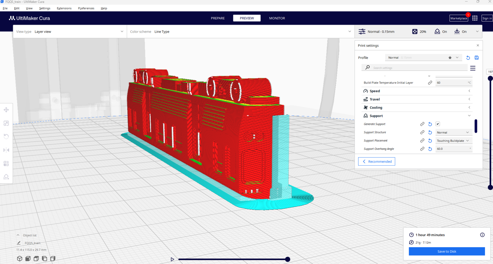
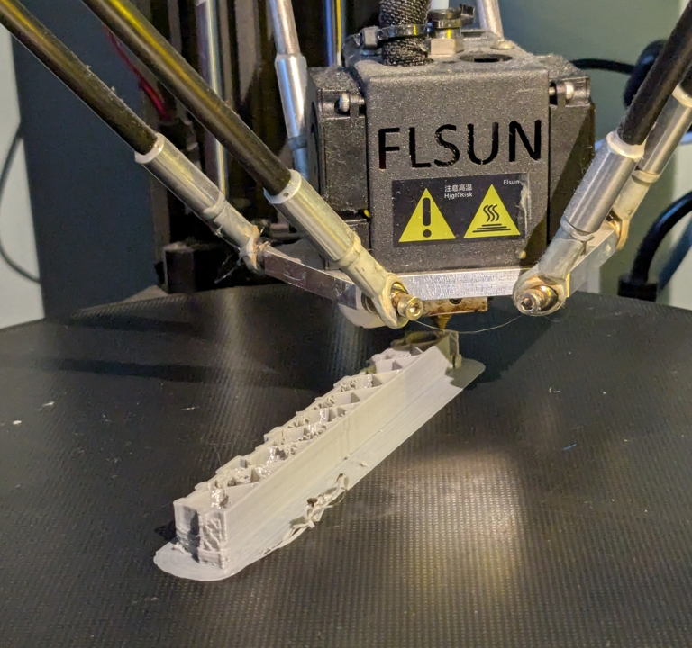
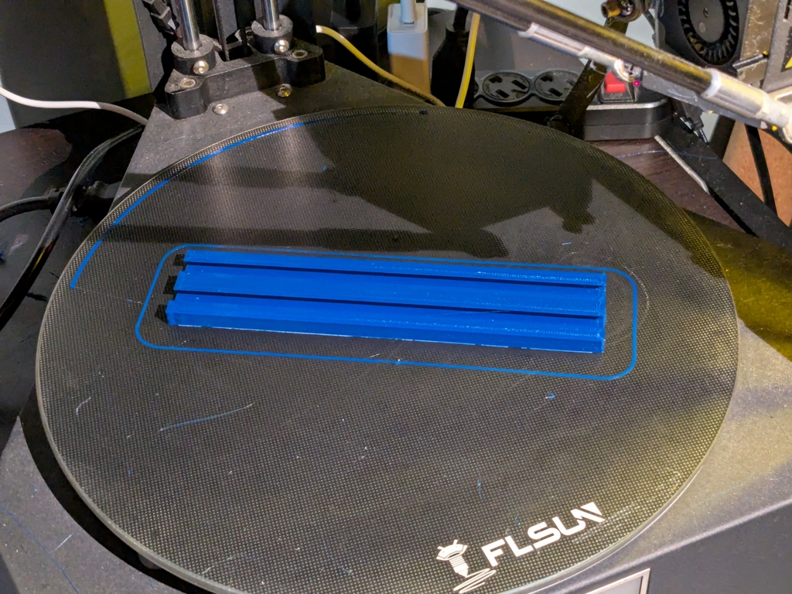

# Train Tracker
My version of the LED Train Trackers that I see on Facebook Ads.
This uses a couple of WS2812B Strips, each LED representing a Blue line stop, one for the Forest Park destination and the other for the O'Hare destination.

I 3D Printed the "tracks" in blue, and 3d modeled the trains myself in 3DS Max using elevation drawings found online.
*Add Screen captures of 3DS Max, images, and photos of progress here*

### 3DS Max

### Cura Slicing

### 3D Printing
Train:

Tracks:

## Bill Of Materials

## Pin assignments for ESP32 Dev Board
320 x 240 ST7789V:
- TFT_MISO = Pin 19
- TFT_MOSI = Pin 23
- TFT_SCLK = Pin 18
- TFT_CS = Pin 15
- TFT_DC = Pin 2
- TFT_RST = Pin 4
- TOUCH_CS = Pin -1
- TFT_BL = Pin 21
- VCC = 5V

WS2812B LEDs
- Data = PIN 5
- VCC = 5V

